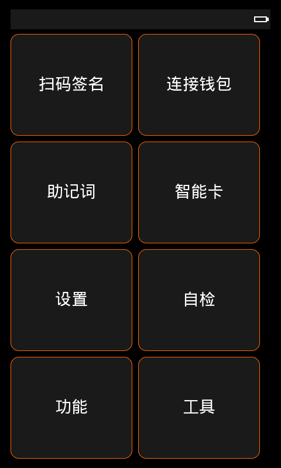
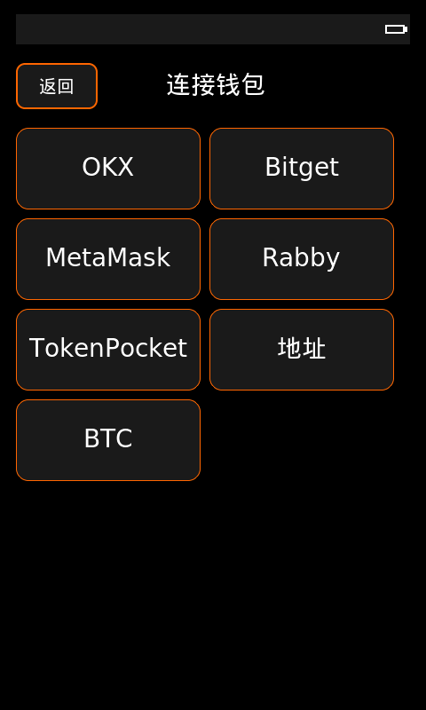
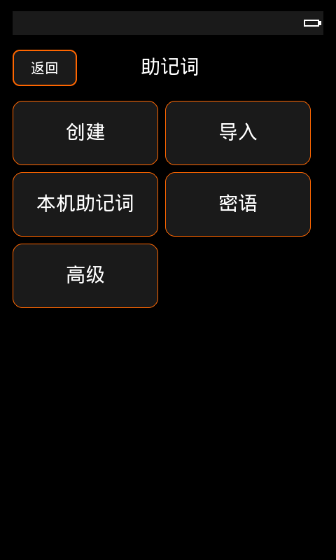
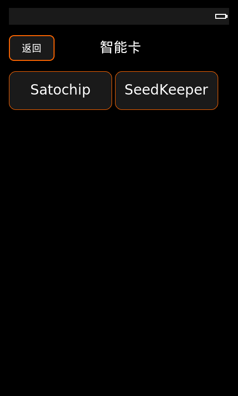
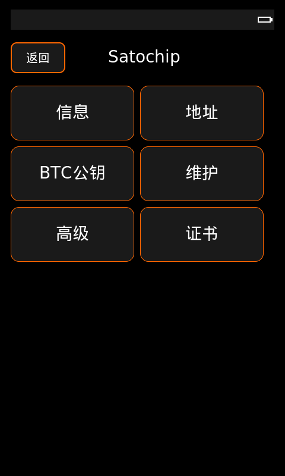
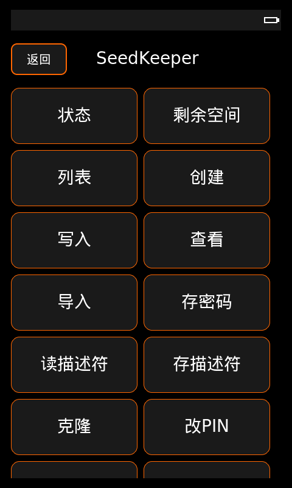
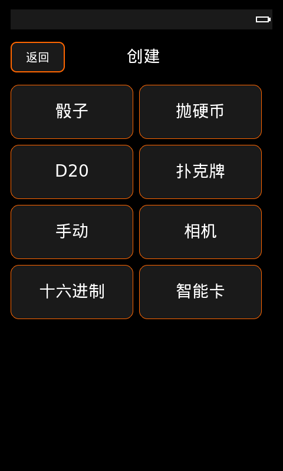
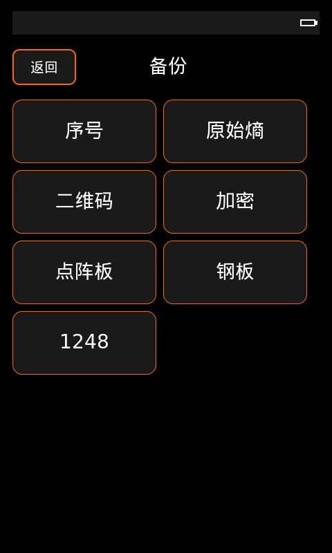

# KernSigner

> **Telegram 电报群 / 项目交流**
>
> 遇到问题、想反馈错误或需要等本人有空协助修改，可以点击这里加入：**[电报群](https://t.me/+wfWuhjH53mVjNDNl)**

> **重要声明 / AI 项目风险提示**
>
> 本项目全部由 AI 完成。本人未对全部功能进行完整检测，可能有很多功能存在错误、缺陷或安全风险。
>
> 请不要默认相信本项目可以直接用于真实资产或生产环境。使用前请自行审查、测试和修改；如果你不会修改，也可以联系本人，在本人有空的时候协助修改。

KernSigner is an experimental ESP32-P4 firmware for air-gapped Bitcoin signing, QR-based wallet workflows, Satochip/SeedKeeper smart-card workflows, and hardware wallet research. It is based on the upstream Kern project and combines ideas, code, and testing notes from several open-source wallet projects.

It uses LVGL for the embedded UI, libwally for Bitcoin primitives, and a C codebase tuned for the Waveshare ESP32-P4 4.3-inch touch-screen device.

One of the most important upstream references here is [3rdIteration/SeedSigner](https://github.com/3rdIteration/seedsigner); its wallet flow, UX patterns, and smart-card-adjacent thinking influenced a large part of the project structure.

This repository was largely assembled with AI assistance. It is still unfinished, intended for learning and discussion only, and must not be used to store or sign real funds.

The current tree is a **test-funds validation build**, not an audited production wallet. It contains real wallet paths and Satochip/Web3 work, but production use with mainnet funds requires the security gates and real-device acceptance checks in `docs/` to pass.

## Screenshots / 界面截图

Common 480x800 UI screenshots are included for GitHub preview and beginner documentation. They are simulator reference images only and do not prove production readiness or real-funds safety.

More screenshots and captions: [docs/screens/gallery/README.md](docs/screens/gallery/README.md)

| 首页 | 连接钱包 | 助记词 | 智能卡 |
| --- | --- | --- | --- |
|  |  |  |  |

| Satochip | SeedKeeper | 创建助记词 | 备份 |
| --- | --- | --- | --- |
|  |  |  |  |

## What Works

- Air-gapped Bitcoin wallet flows: load or create a mnemonic, view public keys and addresses, review wallet data, and enter signing flows.
- QR input/output: SeedQR, PSBT/message-signing paths, BBQR/cUR plumbing, text QR generation, and QR classification.
- Mnemonic and backup tooling: manual word entry, numbered imports, grid/1248/Tinyseed/Stackbit-style restore paths, encrypted backup pages, and BIP39 checks.
- Custom derivation: Bitcoin legacy, nested SegWit, native SegWit, Taproot, testnet variants, and EVM address display.
- Satochip smart-card validation paths: USB CCID detection, ATR/status reads, Web3 connection/signing tests, path address display, and BTC watch-only public keys.
- Hardware tooling: display/touch setup, camera preview, storage browser, brightness control, device status, and real-device delivery checks.
- Desktop simulator: runs the LVGL UI in an SDL2 window for UI review and automated screenshots.

## Safety Status

Use this repository with test seeds and test funds only unless you have independently completed the production release gate.

Known release boundaries:

- Not audited for production custody.
- Secure Boot, Flash Encryption, NVS encryption, debug-port closure, and release provenance must be verified before any commercial or mainnet funds build.
- Satochip PIN/maintenance, SeedKeeper management, Web3 connection/signing, and BTC watch-only public-key paths are exposed for development testing, but they are not audited production wallet guarantees.
- Web3/Satochip signing has passed limited manual validation and still needs broad wallet-format, failure-path, and powered-OTG regression.

Start with [docs/README.md](docs/README.md) for the full delivery and acceptance map.

## Supported Hardware

KernSigner currently supports **only** this development board:

| Board | Config | Display | Touch | Camera |
| --- | --- | --- | --- | --- |
| [ESP32-P4-WiFi6-Touch-LCD-4.3](https://www.waveshare.com/esp32-p4-wifi6-touch-lcd-4.3.htm) | `wave_43` | 480x800 MIPI DSI | GT911 | OV5647 |

Other Waveshare ESP32-P4 display boards are not supported by this project unless you independently port, test, and fix the board-specific display, touch, camera, UI layout, and power paths.

An OV5647 camera module is required for camera and QR workflows.

ESP32-P4 itself has no Wi-Fi or BLE radio. The supported Waveshare 4.3 board includes an ESP32-C6 companion chip, but Kern's signer model treats the firmware as an offline, QR-first device.

## Smart-Card OTG Power / 智能卡 OTG 供电

实测结论：这块开发板的 OTG 口不能稳定给 ACR39U-NF Pocketmate II 这类 USB-C 智能卡读卡器提供 5V 外设供电。读卡器直插开发板 OTG 口时，常见现象是灯只闪一下、亮度很弱、枚举不到设备、能看到 Hub 但看不到读卡器，或者签名过程中掉线。

智能卡功能要正常工作，请使用 **带供电 OTG 转接线** 或 **真正外接供电的 USB Hub**。连接方向如下：

```text
ESP32-P4 OTG 口
-> 带供电 OTG 转接线 / 外接供电 Hub
-> ACR39U-NF Pocketmate II 读卡器
-> Satochip / SeedKeeper 智能卡
```


不要把“电脑能识别读卡器”理解成“开发板直插也能给读卡器供电”。电脑 USB 口和 ESP32-P4 OTG Host 口的供电条件不是一回事。详细排障看 [智能卡供电和 OTG 排障](docs/TROUBLESHOOTING_SMARTCARD_POWER_OTG.md)。

## 3D Printed Case / 3D 打印外壳

本仓库已收录 Waveshare ESP32-P4 4.3 寸带摄像头版本的 AI/OpenSCAD 外壳草模和实打照片：

- 外壳目录：[hardware/cases/waveshare_esp32_p4_wifi6_touch_lcd_4_3_camera](hardware/cases/waveshare_esp32_p4_wifi6_touch_lcd_4_3_camera)
- 主壳 STL：[screen_protective_case.stl](hardware/cases/waveshare_esp32_p4_wifi6_touch_lcd_4_3_camera/screen_protective_case.stl)
- 参数化源码：[esp32_p4_4_3_camera_case.scad](hardware/cases/waveshare_esp32_p4_wifi6_touch_lcd_4_3_camera/esp32_p4_4_3_camera_case.scad)

注意：这版外壳已经打印过一次，实物开孔位置不准，照片中的孔位是后期用火烧/热熔方式手工补开的。请不要直接批量打印当前 STL，先按实物重新量孔位再改模型。

| 实打外壳 | 补孔记录 |
| --- | --- |
|  |  |

## Repository Layout

```text
main/core/          Bitcoin, key, PSBT, PIN, storage, EVM, and wallet logic
main/pages/         LVGL page flows and wallet screens
main/ui/            Reusable UI widgets, theme, icons, fonts, and navigation
main/qr/            QR parser, scanner, encoder, and viewer
main/smartcard/     USB CCID and Satochip integration
main/krux_port/     Krux-style shell, hardware probes, and service adapters
components/         ESP-IDF components and third-party libraries
simulator/          SDL2 desktop simulator
scripts/            Format, test, CI, and release helpers
tools/              Delivery, production-check, and asset-baking helpers
docs/               Acceptance plans, security gates, and delivery records
wallet/             Android relay wallet app for high-density QR handoff
hardware/           3D printed case files, OpenSCAD source, and fit notes
```

## Download Firmware / 直接下载固件

Prebuilt firmware is included for beginners who only want to flash the supported board:

- Full one-file firmware: [firmware/wave_43/kernsigner-wave43-0.0.7-rc1-untested-full.bin](firmware/wave_43/kernsigner-wave43-0.0.7-rc1-untested-full.bin)
- App-only firmware: [firmware/wave_43/kernsigner-wave43-0.0.7-rc1-untested-app.bin](firmware/wave_43/kernsigner-wave43-0.0.7-rc1-untested-app.bin)
- Beginner flashing guide: [firmware/wave_43/README.zh-CN.md](firmware/wave_43/README.zh-CN.md)
- SHA256 checksums: [firmware/wave_43/SHA256SUMS.txt](firmware/wave_43/SHA256SUMS.txt)

For a first-time board or a board with unknown firmware, use the full firmware at offset `0x0`. If the board already runs this project and you only want to update the app, use the app-only firmware at offset `0x20000`.

Android relay APK for dense QR handoff:

- Included copy: [wallet/dist/smartcard-compat-v0.1.19-usbt1-release.apk](wallet/dist/smartcard-compat-v0.1.19-usbt1-release.apk)
- Release download mirror: [akg5188/satochip-signer releases](https://github.com/akg5188/satochip-signer/releases)
- Android relay guide: [docs/ANDROID_RELAY_WALLET_GUIDE.zh-CN.md](docs/ANDROID_RELAY_WALLET_GUIDE.zh-CN.md)

## Prerequisites

The included firmware was built with ESP-IDF v5.5.4 for ESP32-P4. To reproduce this snapshot as closely as possible, use the same ESP-IDF version:

```bash
git clone --depth 1 --recurse-submodules --shallow-submodules \
  -b v5.5.4 https://github.com/espressif/esp-idf.git ~/esp/esp-idf-v5.5.4
~/esp/esp-idf-v5.5.4/install.sh esp32p4
. ~/esp/esp-idf-v5.5.4/export.sh
```

Simulator builds also need SDL2 and mbedTLS:

```bash
# Debian/Ubuntu
sudo apt install build-essential cmake libsdl2-dev libmbedtls-dev

# macOS
brew install cmake sdl2 mbedtls
```

## Clone

This repository uses submodules:

```bash
git clone --recursive https://github.com/akg5188/KernSigner.git
cd KernSigner
```

If you already cloned without submodules:

```bash
git submodule update --init --recursive
```

## Build Firmware

Build the supported `wave_43` target with its matching `sdkconfig.defaults.wave_43` file:

```bash
. ~/esp/esp-idf-v5.5.4/export.sh
idf.py -B build_wave_43_fresh \
  -D SDKCONFIG=build_wave_43_fresh/sdkconfig \
  -D 'SDKCONFIG_DEFAULTS=sdkconfig.defaults;sdkconfig.defaults.wave_43' \
  build
```

Flash and monitor with ESP-IDF:

```bash
idf.py -B build_wave_43_fresh -p /dev/ttyACM0 flash monitor
```

If the build directory contains stale configuration, clean first:

```bash
idf.py -B build_wave_43_fresh fullclean
```

## Desktop Simulator

The simulator renders the LVGL UI in an SDL2 window:

```bash
cd simulator
cmake -B build -S . -DCMAKE_BUILD_TYPE=Debug
cmake --build build -- -j"$(nproc)"
./build/kern_simulator
```

Useful options:

```bash
./build/kern_simulator --width 480 --height 800
./build/kern_simulator --qr-image path/to/qr.png
./build/kern_simulator --qr-dir path/to/qr-images
./build/kern_simulator --data-dir /tmp/kern-sim-data
```

See [simulator/README.md](simulator/README.md) for webcam support and platform notes.

## Test And Check

Run unit tests:

```bash
./scripts/test.sh
```

Run formatting:

```bash
./scripts/format.sh
./scripts/format.sh --check
```

Run the local CI bundle used by commit-history checks:

```bash
./scripts/ci-checks.sh
```

Run the delivery and production checks used by the current validation workflow:

```bash
tools/kern_delivery.sh check
tools/kern_delivery.sh final
tools/kern_delivery.sh prodcheck
```

`prodcheck` is expected to fail on normal development builds until production security options and release provenance are deliberately enabled.

## Release Packages

`scripts/release.sh` builds release zips for all supported boards. It reads the version from `version.txt` and writes packages under `release/v<version>/`:

```bash
./scripts/release.sh
```

Pre-release firmware, when published, is for testing. Do not use pre-release builds for real savings or commercial custody.

Merged binary flashing:

```bash
esptool --chip esp32p4 --baud 460800 write-flash 0x0 \
  firmware/wave_43/kernsigner-wave43-0.0.7-rc1-untested-full.bin
```

To preserve NVS data, flash individual binaries instead:

```bash
esptool --chip esp32p4 --baud 460800 write-flash \
  0x2000 bootloader.bin \
  0x8000 partition-table.bin \
  0xf000 ota_data_initial.bin \
  0x20000 kernsigner-wave43-0.0.7-rc1-untested-app.bin
```

## Documentation

- [Documentation index](docs/README.md)
- [Prebuilt firmware flashing guide](firmware/wave_43/README.zh-CN.md)
- [Zero-background first-use guide](docs/零基础第一次上手教程.zh-CN.md)
- [Beginner quick start](docs/USER_QUICK_START.zh-CN.md)
- [Full operation manual](docs/全功能操作总手册.zh-CN.md)
- [Mnemonic creation and BIP39 verification](docs/MNEMONIC_CREATION_BIP39_VERIFY.zh-CN.md)
- [Backup and recovery guide](docs/BACKUP_AND_RECOVERY_GUIDE.zh-CN.md)
- [Build, flash, and debug guide](docs/BUILD_FLASH_DEBUG_GUIDE.zh-CN.md)
- [General troubleshooting](docs/TROUBLESHOOTING_GENERAL.zh-CN.md)
- [Android build environment](docs/安卓构建环境准备.zh-CN.md)
- [Third-party notices](docs/THIRD_PARTY.md)
- [Hardware overview and OTG notes](docs/HARDWARE_OVERVIEW_AND_OTG.md)
- [First delivery note](docs/README_FIRST_DELIVERY.md)
- [Delivery status and acceptance checklist](docs/DELIVERY_STATUS.md)
- [Commercial release gate](docs/COMMERCIAL_RELEASE_GATE.md)
- [Secure boot notes](docs/secure-boot.md)
- [Security plan](docs/security-plan.md)
- [Roadmap](ROADMAP.md)
- [Contributing](CONTRIBUTING.md)
- [Contributors and credits](CONTRIBUTORS.md)

## Inspirations

KernSigner is strongly inspired by [Kern](https://github.com/odudex/Kern), [Krux](https://github.com/selfcustody/krux), [Blockstream Jade](https://github.com/Blockstream/Jade), [SeedSigner](https://github.com/SeedSigner/seedsigner), [3rdIteration/SeedSigner](https://github.com/3rdIteration/seedsigner), [Specter-DIY](https://github.com/cryptoadvance/specter-diy), [Toporin/Satochip](https://github.com/Toporin), and `satochip-signer` smart-card reference material.

Kern uses [libwally-core](https://github.com/ElementsProject/libwally-core/) for Bitcoin primitives.

## License

[MIT](LICENSE)
