# 常用界面截图

这些截图来自 480x800 桌面模拟器页面，用于 GitHub 预览、文档说明和新手找入口。

注意：截图只表示界面流程可以展示，不代表所有功能已经完成真机验证、资金安全验证或生产审计。真实资产使用前必须先完成项目里的安全检查和真机验收。

## 快速预览

| 首页 | 连接钱包 | Web3 钱包 |
| --- | --- | --- |
| 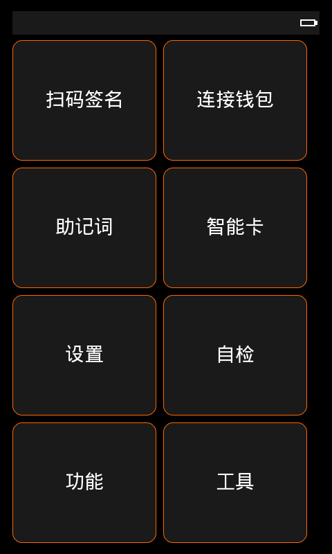 | 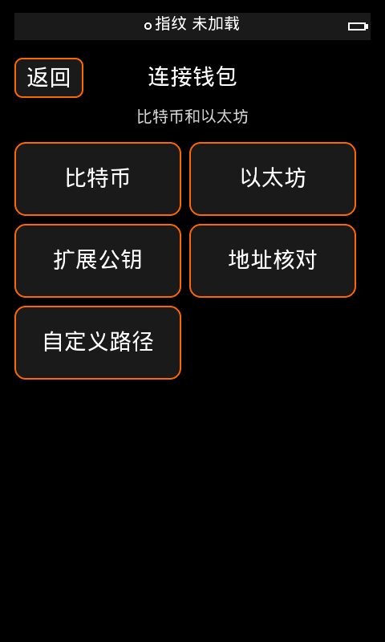 | 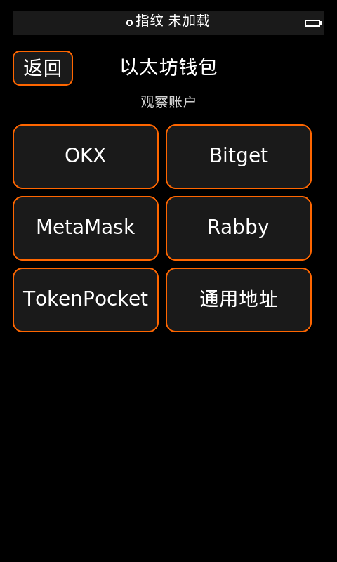 |

| 助记词工具 | 创建助记词 | 导入助记词 |
| --- | --- | --- |
| 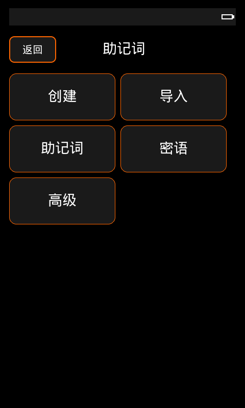 | 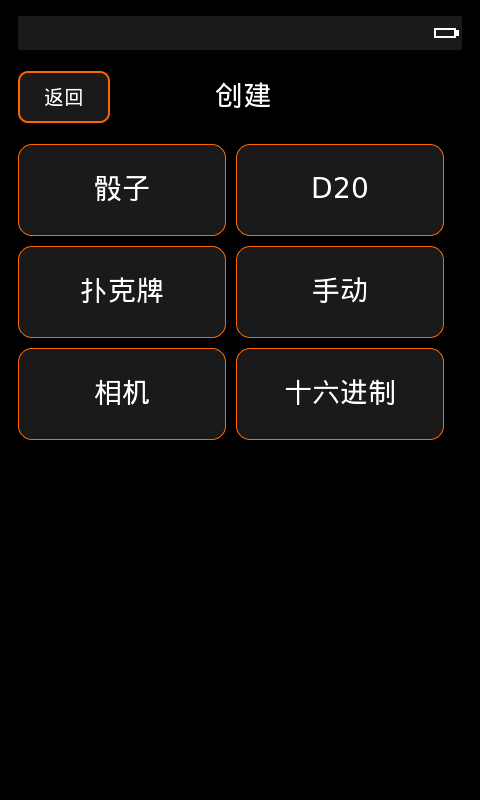 | 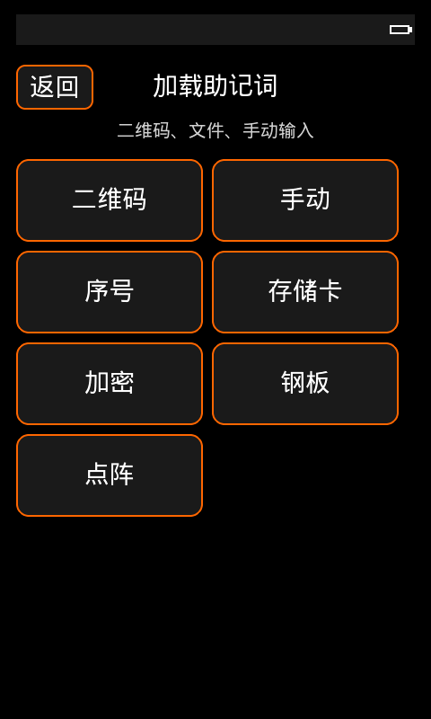 |

| 扫码签名 | 备份 | 智能卡工具 |
| --- | --- | --- |
| 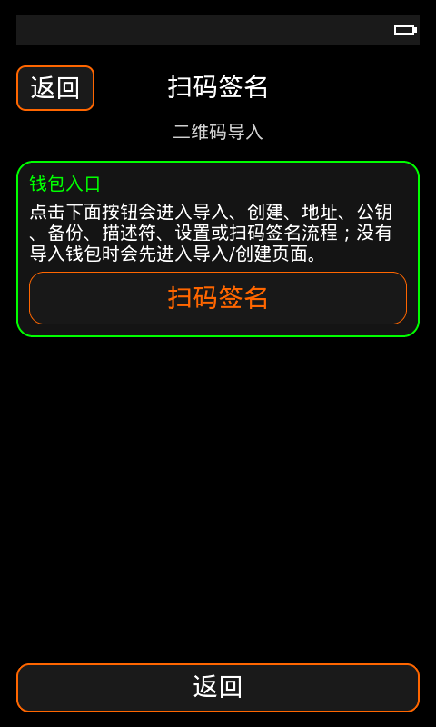 | 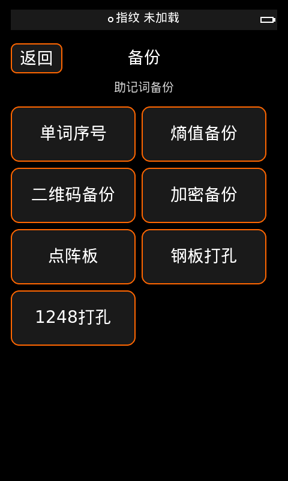 | 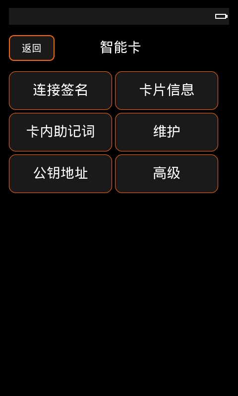 |

| 自定义派生路径 | 创建 QR | 显示设置 |
| --- | --- | --- |
| 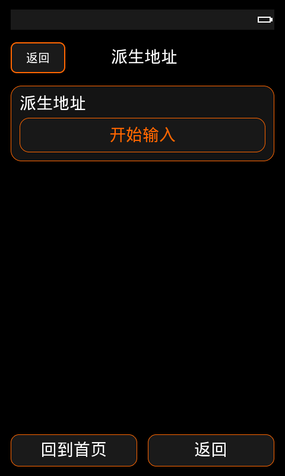 | 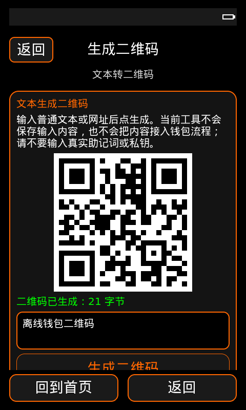 | 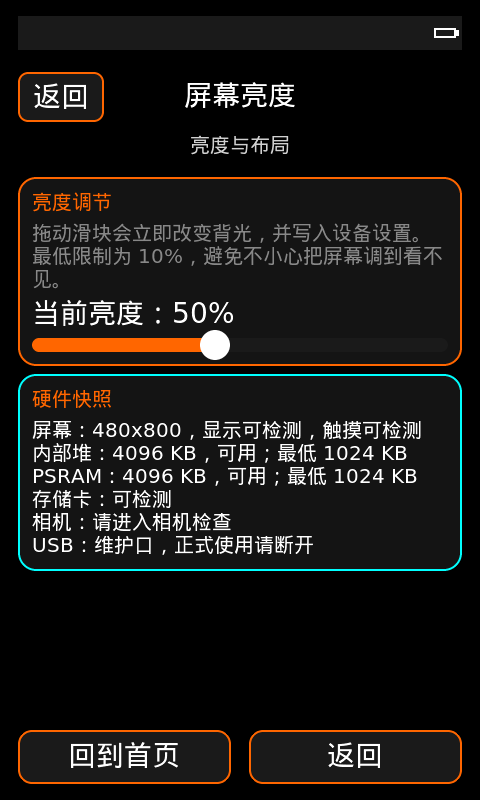 |

## 文件说明

| 文件 | 说明 |
| --- | --- |
| `home.png` | 首页和主要入口。 |
| `connect_wallet.png` | 连接钱包入口。 |
| `web3_wallets.png` | Web3 商业钱包连接入口。 |
| `mnemonic_tools.png` | 助记词相关工具入口。 |
| `new_mnemonic.png` | 创建新助记词页面。 |
| `load_mnemonic.png` | 导入/恢复助记词页面。 |
| `scan_sign.png` | 扫码签名入口。 |
| `backup.png` | 备份导出入口。 |
| `smartcard_tools.png` | 智能卡/Satochip 工具入口。 |
| `custom_derivation.png` | 自定义派生路径页面。 |
| `create_qr.png` | 创建 QR 工具。 |
| `settings_display.png` | 显示设置页面。 |
