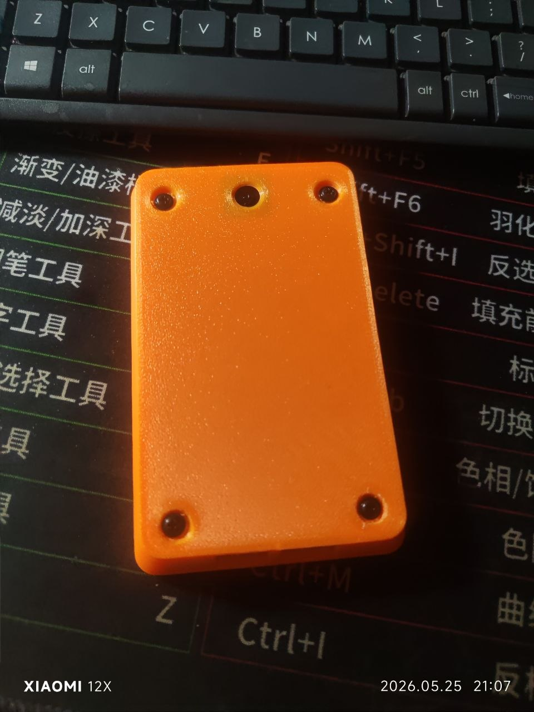
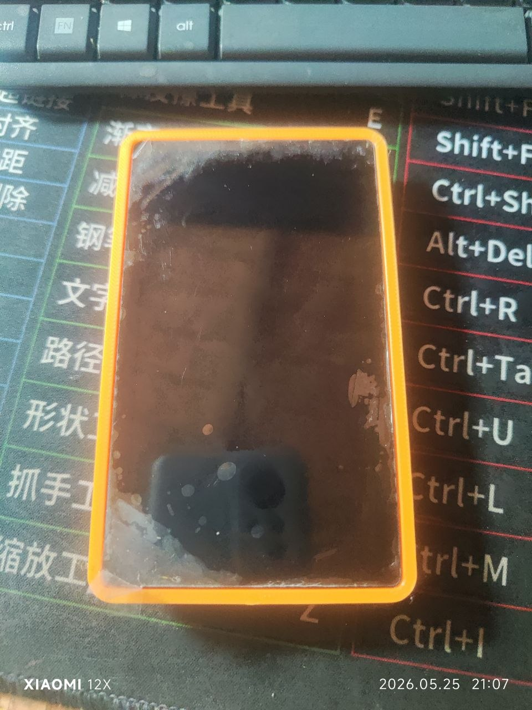
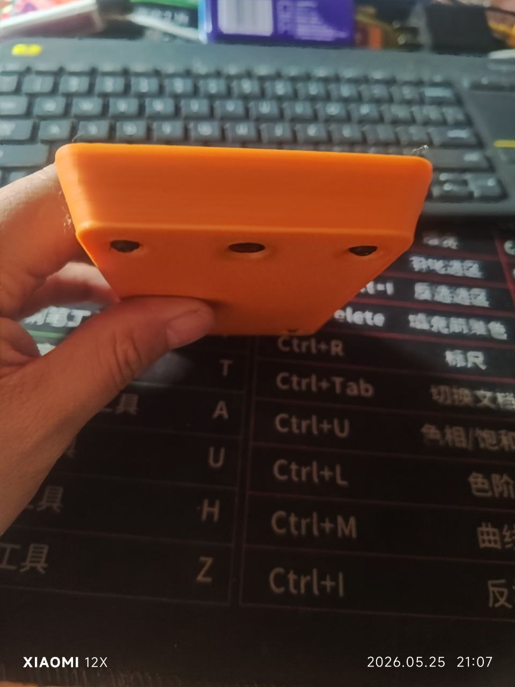

# Waveshare ESP32-P4-WIFI6-Touch-LCD-4.3 屏幕保护壳（已实际打印装配验证）

这是给 Waveshare `ESP32-P4-WIFI6-Touch-LCD-4.3` 带摄像头版本做的单件托盘式保护壳。板子从正面放进去，背面保护 PCB，屏幕四周有一圈略高的长方形保护边，跌落或正面朝下放置时先碰到外壳边缘。

> 实打反馈：这版外壳已经实际打印并装配，可正常使用。之前屏幕一圈如果做得太紧，会因为挤压屏幕出现斑块；当前版本已按这个反馈把屏幕一圈额外放宽约 `0.50mm`，优先避免压屏。

## 当前设计

- 单件主壳：`screen_protective_case.stl`
- NFC 凸底版：`screen_protective_case_nfc.stl`（未实打验证）
- 预览图：`case_preview.png`
- NFC 凸底版预览图：`nfc_case_preview.png`
- 这版已经实际打印装配，可正常使用。
- 屏幕一圈按实打反馈额外放宽约 `0.50mm`，避免挤压屏幕出现斑块。
- 只保留这些开口：两个 USB-C、一个摄像头孔、四个螺丝孔。
- TF/SD 卡口已封住，POWER / BOOT / RESET 三个侧边按键孔也全部封住。
- 不保留 GPIO、麦克风、散热槽等其他开口。
- 固定方式：推荐用板子已有四角孔，从壳底穿 4 颗更长螺丝固定。
- PCB 不按屏幕正中放置，而是按官方背面机械图偏移。
- 官方图是背面视角；模型已在 X 方向镜像，按屏幕朝向你时去比对。
- USB 开口已按实打反馈收窄并向背面 PCB 侧偏置，减少靠屏幕面的切口。
- USB-C 开口靠屏幕方向额外加高 `2.00mm`，给插头更多余量。
- 屏幕正面保护边整圈已加高 `0.50mm`，当前高度为 `1.70mm`。
- 摄像头外侧只留圆孔，内侧留方形凹槽给摄像头模组避空。
- 摄像头孔在摄像头短边这一列，距摄像头短边 `11.00mm`；到上下两条长边各 `33.60mm`，圆孔直径 `5.00mm`。
- NFC 凸底版把整块背面底板下沉到 `6.00mm` 深，形成更平整的一体打印底面；内部仍按之前可装配版本保留长 NFC 凹槽，不改变原来的主板放置凹槽，也不遮挡四个螺丝孔和相机孔。原版外壳不带这个凸底。
- 因为 SD 卡槽和侧边按键都封住了，日常操作主要依赖触摸屏、USB-C、摄像头和固件自身功能；如果需要频繁按实体 POWER/BOOT/RESET 或插拔 SD 卡，不要直接打印这一版。

## 预览


### NFC 凸底版


## 实拍

已打印装配实拍：

### 正面



### 背面



### 侧面



## 打印前请确认

- 这版已经实打装配验证，可作为当前可用版本。
- 如果打印材料、打印机公差或装配方式不同，仍建议先打一个确认屏幕、USB-C、摄像头、螺丝孔和整体手感。
- 屏幕一圈如果做得过紧，会因为挤压屏幕出现斑块；当前版本已优先放宽约 `0.50mm` 来避免压屏。
- 特别确认 SD 卡槽和 POWER / BOOT / RESET 三个侧边按键是否可以接受被封住。
- NFC 凸底版 `screen_protective_case_nfc.stl` 只是按本次 PN532/NFC 模块位置改出的未验证版，建议先用 PLA 快速打一件确认 NFC 模块、排线和螺丝不会顶住。
- 如果孔位不合适，优先改 OpenSCAD 参数，再重新导出 STL。
- 当前 GitHub 保留两个打印文件：原版 `screen_protective_case.stl` 和 NFC 凸底版 `screen_protective_case_nfc.stl`。

## 修改记录

- `2026-06-01`：未实际打印装配验证。按发给卖家的 NFC 打印文件恢复长凹槽基准：深 `6.00mm`，内部凹槽从摄像头侧螺丝孔往内 `8.00mm` 起，到 USB-C 侧螺丝孔往内 `25.00mm` 止，左右沿原收腰底板走；外底改成整块背面平整一体下沉，让螺丝孔和相机孔周围也落在同一打印底面上，减少悬空桥接毛边。
- `2026-05-30`：未实际打印装配验证。新增 NFC 凸底版 `screen_protective_case_nfc.stl`，原版外壳保留。NFC 凸包只在外侧背面新增，不改变原来的主板放置凹槽；左右两侧直接做到原收腰底板两侧；上下位置按实测从摄像头侧螺丝孔往内 `8.00mm` 开始，到 USB-C 侧螺丝孔往内 `25.00mm` 结束；凸包与原底板做 `0.80mm` 实体重叠，避免切片时出现贴合缝。
- `2026-05-25`：这版外壳已实际打印装配验证，可正常使用。根据实打反馈，屏幕一圈如果过紧会因挤压屏幕出现斑块，因此当前版本特意把屏幕一圈额外放宽约 `0.50mm`，优先避免压屏。
- `2026-05-21`：只修正正面屏幕/玻璃保护圈。根据上一轮试打反馈，屏幕四周约大 `0.5mm`，已把 `glass_clearance` 从 `0.38` 改为 `0.12`，开口总宽/总高各收小约 `0.52mm`。USB、TF、按钮、摄像头、螺丝孔暂时不改，后续按实物逐项修。
- `2026-05-21`：修正两个 USB-C 侧边开孔。中间隔条改为 `3.00mm`；左右两个最外侧各填充 `4.00mm`，避免开孔过大；靠屏幕/正面一侧整体填充 `1.50mm`，降低两个 C 口开孔高度。其他开孔暂时不改。
- `2026-05-21`：封掉 TF/SD 卡大开口。侧面 POWER/BOOT/RESET 不再开大孔，早期曾保留 `1.00mm` 针孔。
- `2026-05-21`：未验证草模按实物反馈把侧面 POWER/BOOT/RESET 三个 `1.00mm` 针孔也全部封住，外壳侧面保持完整。
- `2026-05-21`：按实测修正摄像头孔。摄像头中心距后盖左侧短边 `15.00mm`，距按键侧长边 `37.00mm`，距无按键侧约 `36.00mm`；外侧圆孔直径改为 `7.00mm`。
- `2026-05-21`：按实测修正四个螺丝孔。四个孔中心到左右侧边均为 `12.00mm`；USB-C 侧到底边 `12.00mm`；无开口侧到顶边 `16.00mm`；孔径改为 `2.50mm` 普通圆孔。
- `2026-05-21`：未验证草模增加螺丝头/垫片凹槽。四个孔外侧增加 `7.20mm` 直径、`1.50mm` 深圆形沉孔，方便约 `6-7mm` 圆头/垫片沉进去。
- `2026-05-21`：未验证草模给四个螺丝沉孔和摄像头孔增加外圈斜坡倒角。螺丝孔入口从 `9.20mm` 过渡到 `7.20mm` 沉孔；摄像头孔入口从 `10.20mm` 过渡到 `7.00mm` 镜头孔，减少直筒孔的生硬感。
- `2026-05-21`：未验证草模把外壳改成“屏幕侧大、PCB/背面侧小”的整体收底结构，不再做局部挖孔。USB-C 方向底壳整体内收 `4.50mm`，两条长边整体内收 `3.00mm`，斜面从更靠近底部的位置开始，用约 `11.20mm` 高的近直线圆滑斜面过渡到屏幕保护圈，尽量消除中间收腰凹陷；底壳外圈加 `0.30mm` 小倒边；内部改成 PCB 小腔体到玻璃大腔体的过渡结构，至少保留约 `1.60mm` 侧壁。
- `2026-05-21`：未验证草模把屏幕外圈四角和底壳外角从 `3.00-5.00mm` 调到 `6.00mm`，让外形更圆润。内侧玻璃开口圆角暂不加大，避免压到屏幕玻璃角。
- `2026-05-21`：对比 SeedSigner 外壳后，考虑本项目屏幕更大、背板跨度更大，暂时保留 `2.20mm` 背板厚度和约 `13.60mm` 总高度，优先保证刚性和螺丝固定可靠性。
- `2026-05-23`：未实际打印装配验证。按最新反馈恢复屏幕/玻璃间隙，避免外壳压屏导致斑点；屏幕正面保护边整圈加高 `0.50mm`，当前 `front_rim_h = 1.70`；屏幕/玻璃间隙保持之前确认过的 `glass_clearance = 0.38`。
- `2026-05-23`：未实际打印装配验证。USB-C 两个开口靠屏幕方向额外加高 `2.00mm`，减少插头被上边挡住的问题。
- `2026-05-23`：未实际打印装配验证。摄像头孔在摄像头短边这一列，距摄像头短边 `11.00mm`，到上下两条长边各 `33.60mm`；圆孔直径 `5.00mm`。
- `2026-05-23`：未实际打印装配验证。四个螺丝孔改为按实际下壳边缘定位：上下长边各 `9.00mm`，摄像头短边 `11.00mm`，C 口短边 `8.00mm`。

## 为什么不用纯卡扣

不建议只靠按压卡扣固定。FDM 打印公差、材料收缩和屏幕玻璃边缘误差都会影响手感：太紧会顶屏幕/挤玻璃，太松会掉。当前设计是“轻微套入 + 四角螺丝固定”，可靠性更高，也更不容易伤屏幕。

如果你确实想无螺丝，可以后续加 0.3-0.5 mm 的软卡点，但建议先打印螺丝版确认外形。

## 螺丝建议

使用开发板原本四个角的安装孔，不需要给板子打新孔。当前孔位已经按下壳实际外边缘定位：

- 先拆掉原来四角短螺丝。
- 换长一点的 M2 或 M2.5 螺丝，从壳底穿进去，锁回开发板四角孔/铜柱。
- 四个螺丝孔中心到下壳上下长边都是 `9.00mm`。
- USB-C 那一侧两个螺丝孔中心到 C 口短边是 `8.00mm`。
- 摄像头那一侧两个螺丝孔中心到摄像头短边是 `11.00mm`。
- 螺丝孔直径：`2.50mm`。
- 螺丝头/垫片凹槽：直径 `7.20mm`，深 `1.50mm`。
- 螺丝孔外圈斜坡：入口直径 `9.20mm`，斜坡深 `0.85mm`。
- 不再使用旧版长圆容错槽和大沉头槽。

## 尺寸来源

Waveshare 官方页面/文档图给出的主要尺寸：

- 前玻璃外形：`114.40 x 66.80 mm`
- 屏幕可视区：`94.40 x 56.96 mm`
- 主 PCB：`102.50 x 60.00 mm`
- PCB 到玻璃左边：约 `6.30 mm`
- PCB 到玻璃右边：`5.60 mm`
- PCB 到玻璃上边：约 `5.20 mm`
- PCB 到玻璃下边：约 `1.60 mm`

参考链接：

- https://www.waveshare.com/esp32-p4-wifi6-touch-lcd-4.3.htm
- https://docs.waveshare.com/ESP32-P4-WIFI6-Touch-LCD-4.3

## 需要优先复核的参数

摄像头孔位按实测后盖定位；外侧圆孔已经收小到 `5.00mm`，里面仍保留方形凹槽：

```scad
camera_center_from_camera_side = 11.00;
camera_center_y_offset_from_center = 0.00;
camera_lens_hole_d = 5.00;
camera_lens_bevel_d = 10.20;
camera_lens_bevel_depth = 1.00;
camera_lens_relief_d = 10.80;
camera_pocket_w = 15.00;
camera_pocket_h = 15.00;
```

屏幕保护边相关：

```scad
front_rim_h = 1.70;
front_rim_w = 2.20;
glass_clearance = 0.38;
```

如果你想保护边更高，可以继续增大 `front_rim_h`；如果贴合太紧，可以增大 `glass_clearance`；如果太松，再减小 `glass_clearance`。

当前螺丝孔按下壳实际外边缘定位：

```scad
mount_long_edge_from_lower_edge = 9.00;
mount_camera_side_from_lower_edge = 11.00;
mount_usb_side_from_lower_edge = 8.00;
```

NFC 凸底版相关：

```scad
nfc_bump_enabled = false; // 导出 NFC 版时用 -D 'nfc_bump_enabled=true'
nfc_bump_depth = 6.00;
nfc_recess_camera_side_from_mount = 8.00;
nfc_recess_usb_side_from_mount = 25.00;
nfc_recess_edge_wall = 2.10;
nfc_bump_overlap = 0.80;
```

当前 USB-C 开口屏幕侧余量：

```scad
usb_screen_side_extra_clearance = 2.00;
```

SD/按钮位置按官方图重算：

```scad
mirror_official_rear_x = true;
tf_slot_x_from_pcb_left = 52.00;
power_x_from_pcb_left = pcb_w - 23.00;
boot_x_from_pcb_left = power_x_from_pcb_left - 8.35;
reset_x_from_pcb_left = boot_x_from_pcb_left - 8.35;
```

边缘开孔靠 PCB/背面一侧：

```scad
port_z_center = back_thickness + 3.30;
tf_slot_h = 5.40;
button_slot_h = 5.20;
```

## 导出 STL

```bash
cd /home/ak/123/KernSigner/hardware/cases/waveshare_esp32_p4_wifi6_touch_lcd_4_3_camera
make all
```

需要先安装 `openscad`。`make all` 会导出原版 `screen_protective_case.stl` 和 NFC 凸底版 `screen_protective_case_nfc.stl`。`make case` 只导出原版，`make nfc` 只导出 NFC 凸底版，`make reference` 可生成带参考板位置的预览 STL，但不是打印件。

GitHub 上用于打印的文件是：

```text
screen_protective_case.stl
screen_protective_case_nfc.stl
```

其他旧外壳打印文件不再保留，避免误打印旧版本。

## 打印建议

- 材料：PETG、ABS 或 ASA；PLA 适合打样。
- 层高：`0.16-0.20 mm`
- 壁线：至少 3 道
- 填充：`20-30%`
- 背面朝下打印，屏幕保护边朝上。
- 摄像头外侧没有凸环，通常不需要为摄像头孔额外支撑。
