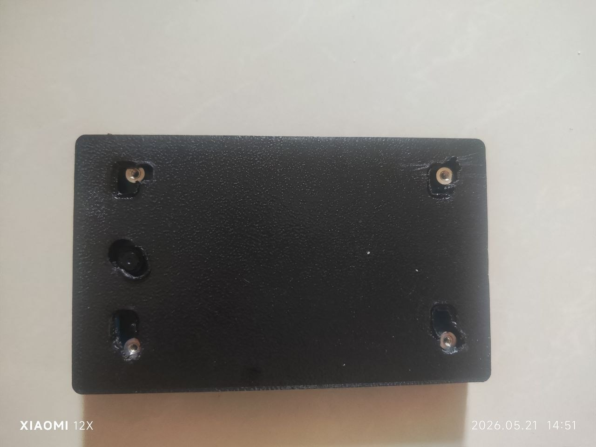
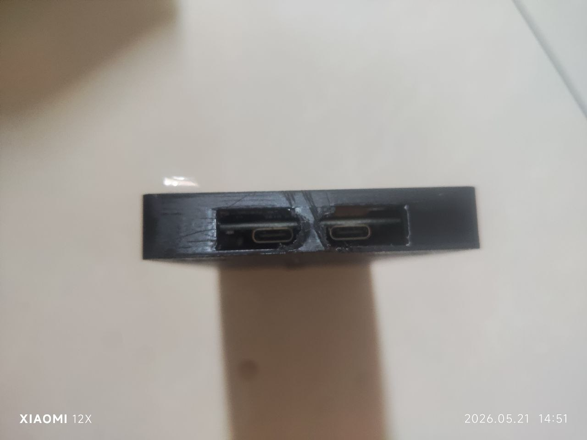
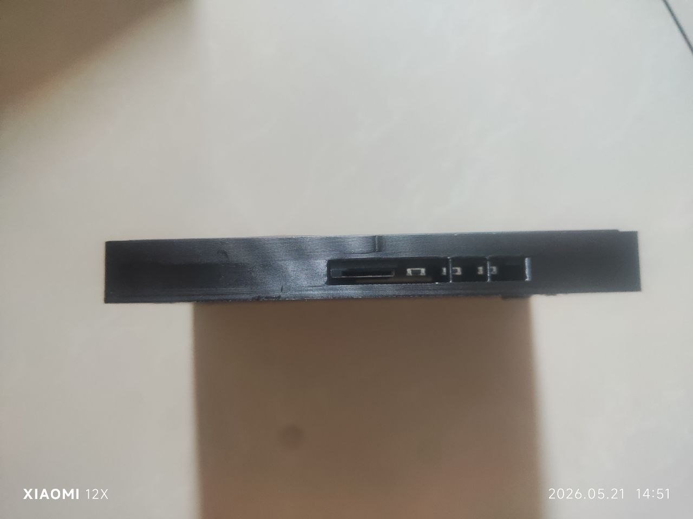
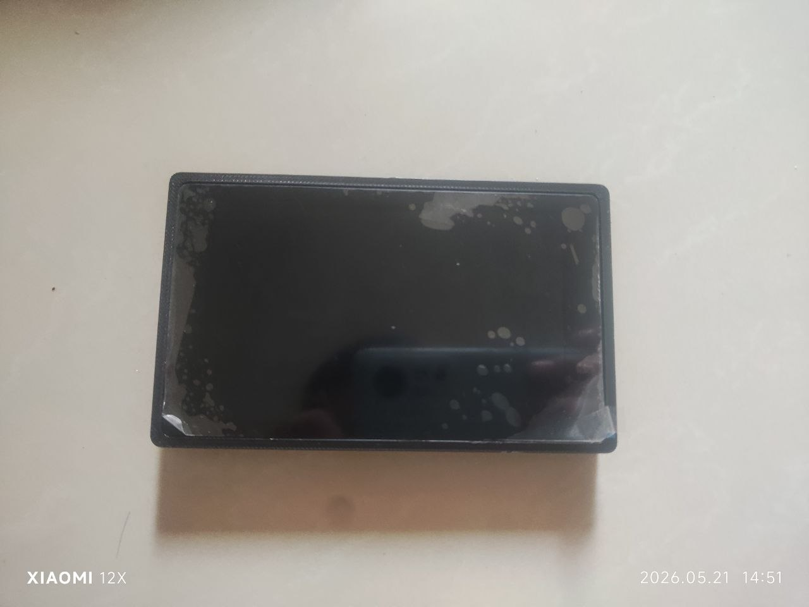

# Waveshare ESP32-P4-WIFI6-Touch-LCD-4.3 屏幕保护壳

这是给 Waveshare `ESP32-P4-WIFI6-Touch-LCD-4.3` 带摄像头版本做的单件托盘式保护壳。板子从正面放进去，背面保护 PCB，屏幕四周有一圈略高的长方形保护边，跌落或正面朝下放置时先碰到外壳边缘。

## 当前设计

- 单件主壳：`screen_protective_case.stl`
- 只保留这些开口：两个 USB-C、一个 TF/SD 卡、三个按钮、一个摄像头孔。
- 不保留 GPIO、麦克风、散热槽等其他开口。
- 固定方式：推荐用板子已有四角孔，从壳底穿 4 颗更长螺丝固定。
- PCB 不按屏幕正中放置，而是按官方背面机械图偏移。
- 官方图是背面视角；模型已在 X 方向镜像，按屏幕朝向你时去比对。
- USB、TF/SD、按钮开口已向背面 PCB 侧偏置，减少靠屏幕面的切口。
- 摄像头外侧只留圆孔，内侧留方形凹槽给摄像头模组避空。

## 实打反馈

这版外壳已经打印过一次，实物反馈是：**开孔位置完全不准**。当前照片里的外壳是后期用火烧/热熔方式手工补开的孔，不能当成最终量产外壳。

已记录照片：

| 背面补孔 | 侧边/细节 | 装配检查 | 其他角度 |
| --- | --- | --- | --- |
|  |  |  |  |

后续如果继续改壳，优先处理：

- 重新按实物量 USB-C、TF 卡、按钮、螺丝孔和摄像头孔位。
- 不要直接批量打印当前 STL。
- 改完 OpenSCAD 参数后，先切薄片验证孔位，再出完整外壳。
- 当前 `screen_protective_case.stl` 是只修正了正面屏幕圈的试打版，其他开孔仍需后续逐项修正。

## 修改记录

- `2026-05-21`：只修正正面屏幕/玻璃保护圈。根据实打反馈，屏幕四周约大 `0.5mm`，已把 `glass_clearance` 从 `0.38` 改为 `0.12`，开口总宽/总高各收小约 `0.52mm`。USB、TF、按钮、摄像头、螺丝孔暂时不改，后续按实物逐项修。

## 为什么不用纯卡扣

不建议只靠按压卡扣固定。FDM 打印公差、材料收缩和屏幕玻璃边缘误差都会影响手感：太紧会顶屏幕/挤玻璃，太松会掉。当前设计是“轻微套入 + 四角螺丝固定”，可靠性更高，也更不容易伤屏幕。

如果你确实想无螺丝，可以后续加 0.3-0.5 mm 的软卡点，但建议先打印螺丝版确认外形。

## 螺丝建议

使用开发板原本四个角的安装孔，不需要给板子打新孔。建议：

- 先拆掉原来四角短螺丝。
- 换长一点的 M2 或 M2.5 螺丝，从壳底穿进去，锁回开发板四角孔/铜柱。
- 当前模型默认做成长圆容错槽：`mount_screw_slot_x = 5.20`、`mount_screw_slot_y = 8.00`。
- 中心孔径偏 M2.5：`mount_screw_clearance_d = 2.80`。
- 如果你手里是 M2 螺丝，把这个参数改成 `2.40`，再运行 `make all`。

## 尺寸来源

Waveshare 官方页面/文档图给出的主要尺寸：

- 前玻璃外形：`114.40 x 66.80 mm`
- 屏幕可视区：`94.40 x 56.96 mm`
- 主 PCB：`102.50 x 60.00 mm`
- PCB 到玻璃左边：约 `6.30 mm`
- PCB 到玻璃右边：`5.60 mm`
- PCB 到玻璃上边：约 `5.20 mm`
- PCB 到玻璃下边：约 `1.60 mm`

参考链接：

- https://www.waveshare.com/esp32-p4-wifi6-touch-lcd-4.3.htm
- https://docs.waveshare.com/ESP32-P4-WIFI6-Touch-LCD-4.3

## 需要优先复核的参数

摄像头孔位按你发的背面图估算；外侧圆孔已经按常见迷你
OV5647/Raspberry Pi 摄像头镜头口收小，里面仍保留方形凹槽：

```scad
camera_center_x_from_pcb_left = 97.40;
camera_center_y_from_pcb_top = 30.60;
camera_lens_hole_d = 8.40;
camera_lens_relief_d = 10.80;
camera_pocket_w = 15.00;
camera_pocket_h = 15.00;
```

屏幕保护边相关：

```scad
front_rim_h = 1.20;
front_rim_w = 2.20;
glass_clearance = 0.45;
```

如果你想保护边更高，可以把 `front_rim_h` 改成 `1.50`；如果贴合太紧，把 `glass_clearance` 增大到 `0.60`。

SD/按钮位置按官方图重算：

```scad
mirror_official_rear_x = true;
tf_slot_x_from_pcb_left = 52.00;
power_x_from_pcb_left = pcb_w - 23.00;
boot_x_from_pcb_left = power_x_from_pcb_left - 8.35;
reset_x_from_pcb_left = boot_x_from_pcb_left - 8.35;
```

边缘开孔靠 PCB/背面一侧：

```scad
port_z_center = back_thickness + 3.30;
tf_slot_h = 5.40;
button_slot_h = 5.20;
```

## 导出 STL

```bash
make all
```

`make all` 只会导出主壳 `screen_protective_case.stl`。`make reference` 可生成带参考板位置的预览 STL，但不是打印件。

## 打印建议

- 材料：PETG、ABS 或 ASA；PLA 适合打样。
- 层高：`0.16-0.20 mm`
- 壁线：至少 3 道
- 填充：`20-30%`
- 背面朝下打印，屏幕保护边朝上。
- 摄像头外侧没有凸环，通常不需要为摄像头孔额外支撑。
